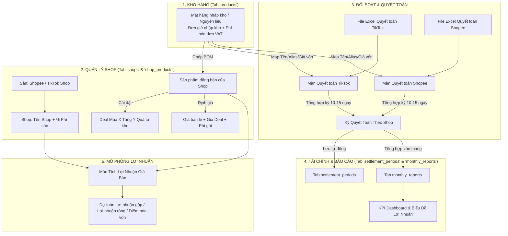
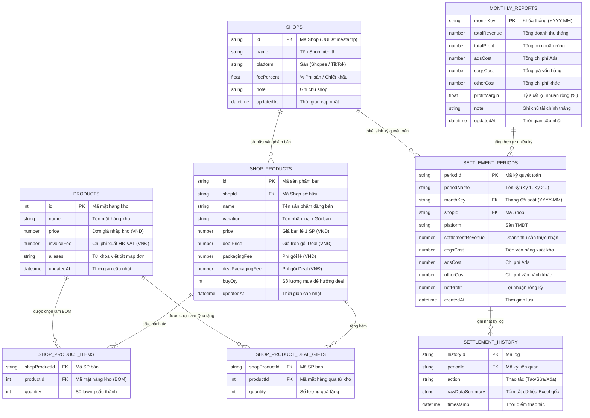

# TÀI LIỆU KIẾN TRÚC, LOGIC NGHIỆP VỤ & ĐỊNH HƯỚNG PHÁT TRIỂN HỆ THỐNG
## HỆ THỐNG QUẢN LÝ BÁN HÀNG, QUYẾT TOÁN & BÁO CÁO TÀI CHÍNH ĐA SÀN (SHOPEE & TIKTOK SHOP)

> **Ngày tạo tài liệu:** 25/08/2026  
> **Phiên bản hệ thống:** v2.6 (Antigravity E-Commerce Suite)  
> **Tác giả / Duy trì:** PhiLV  

---

## 📑 MỤC LỤC
1. [Tổng Quan Hệ Thống](#1-tổng-quan-hệ-thống)
2. [Kiến Trúc Kỹ Thuật & Mô Hình Tổng Thể](#2-kiến-trúc-kỹ-thuật--mô-hình-tổng-thể)
3. [Sơ Đồ Luồng Dữ Liệu Toàn Cục](#3-sơ-đồ-luồng-dữ-liệu-toàn-cục)
4. [Chi Tiết Nghiệp Vụ & Logic Từng Màn Hình](#4-chi-tiết-nghiệp-vụ--logic-từng-màn-hình)
   - [4.1. Màn Dashboard Trung Tâm (`index.html`)](#41-màn-dashboard-trung-tâm-indexhtml)
   - [4.2. Màn Báo Cáo Tháng & Kỳ Quyết Toán (`bao-cao-thang.html`)](#42-màn-báo-cáo-tháng--kỳ-quyết-toán-bao-cao-thanghtml)
   - [4.3. Màn Quyết Toán TikTok Shop (`quyet-toan.html`)](#43-màn-quyết-toán-tiktok-shop-quyet-toanhtml)
   - [4.4. Màn Quyết Toán Shopee (`quyet-toan-shopee.html`)](#44-màn-quyết-toán-shopee-quyet-toan-shopeehtml)
   - [4.5. Màn Quản Lý Shop & Sản Phẩm Đăng Bán (`quan-ly-shop.html`)](#45-màn-quản-lý-shop--sản-phẩm-đăng-bán-quan-ly-shophtml)
   - [4.6. Màn Tính Lợi Nhuận Theo Giá Bán (`loi-nhuan-gia-ban.html`)](#46-màn-tính-lợi-nhuận-theo-giá-bán-loi-nhuan-gia-banhtml)
   - [4.7. Nhóm Công Cụ Tiện Ích (Crawl Ảnh, PDF to Image, WebP to JPEG)](#47-nhóm-công-cụ-tiện-ích)
5. [Mô Hình Dữ Liệu, Chi Tiết Các Bảng & Ý Tưởng Quan Hệ (Data Model & Relationships)](#5-mô-hình-dữ-liệu-chi-tiết-các-bảng--ý-tưởng-quan-hệ)
   - [5.1. Sơ Đồ Quan Hệ Thực Thể (ERD - Entity Relationship Diagram)](#51-sơ-đồ-quan-hệ-thực-thể-erd)
   - [5.2. Từ Điển Dữ Liệu & Chi Tiết Các Cột Trong Từng Bảng (Data Dictionary)](#52-từ-điển-dữ-liệu--chi-tiết-các-cột-trong-từng-bảng)
   - [5.3. Ý Tưởng & Triết Lý Thiết Kế Mối Quan Hệ Giữa Các Bảng](#53-ý-tưởng--triết-lý-thiết-kế-mối-quan-hệ-giữa-các-bảng)
6. [Cơ Chế Đồng Bộ & Tích Hợp Google Sheet](#6-cơ-chế-đồng-bộ--tích-hợp-google-sheet)
7. [Công Thức Tài Chính & Thuật Toán Trọng Yếu](#7-công-thức-tài-chính--thuật-toán-trọng-yếu)
8. [Định Hướng Phát Triển & Tính Năng Tương Lai (Roadmap)](#8-định-hướng-phát-triển--tính-năng-tương-lai-roadmap)

---

## 1. TỔNG QUAN HỆ THỐNG

### 1.1. Bối cảnh & Mục tiêu
Hệ thống được thiết kế để giải quyết toàn diện bài toán tài chính, quản lý giá vốn và đối soát doanh thu cho nhà bán hàng đa sàn thương mại điện tử (chủ lực là **Shopee** và **TikTok Shop**). 

Hệ thống tập trung giải quyết các bài toán cốt lõi:
1. **Quản lý giá vốn thực tế (BOM - Bill of Materials):** Tách bạch giữa **Mặt hàng nhập kho** (nguyên liệu, hàng nhập đơn lẻ) và **Sản phẩm đăng bán của từng Shop** (Combo, Set quà, Gói khuyến mãi Mua X Tặng Y).
2. **Phân cấp Shop theo từng Sàn:** Một sàn có thể quản lý nhiều Shop với % chiết khấu phí sàn và chi phí vận hành khác nhau.
3. **Đối soát tự động từ File Excel quyết toán:** Đọc trực tiếp sao kê quyết toán và chi tiết đơn hàng từ TikTok Seller Center / Shopee Seller Center, tự động bóc tách doanh thu thực nhận, chi phí sàn, đơn hoàn, phạt và đối soát với giá vốn xuất kho để tính ra lợi nhuận ròng của từng kỳ.
4. **Quản lý tài chính theo Kỳ (10-15 ngày) & Tháng:** Tổng hợp các kỳ quyết toán thành báo cáo tài chính tháng hoàn chỉnh.
5. **Mô phỏng & Định giá bán:** Công cụ tính toán nhanh lợi nhuận gộp/ròng theo các mức giá bán, tỷ lệ chi phí Ads, phí đóng gói, phí xuất hóa đơn VAT.
6. **Lưu trữ & Đồng bộ đám mây 2 chiều:** Sử dụng LocalStorage-first cho trải nghiệm tức thì (offline-capable) kết hợp với Google Sheet thông qua Google Apps Script Web App làm cơ sở dữ liệu đám mây an toàn, không tốn chi phí máy chủ.

---

## 2. KIẾN TRÚC KỸ THUẬT & MÔ HÌNH TỔNG THỂ

### 2.1. Kiến Trúc Ứng Dụng (Architecture Overview)
- **Frontend Architecture:** Single Page Shell với Iframe Sub-applications (`index.html` điều hướng các module con).
- **Core Technologies:** HTML5, CSS3 Modern (CSS Grid, Flexbox, Custom Properties), Vanilla JavaScript (ES6+), Chart.js (Biểu đồ), XLSX.js & JSZip (Xử lý Excel/Zip).
- **Styling Framework:** Custom Design System (`Outfit` Font, Color Tokens, Responsive Drawer Menu cho Mobile/Tablet).
- **Backend & Cloud Database:** Google Sheets API thông qua **Google Apps Script (GAS)** triển khai dạng Web App REST API / JSONP.

### 2.2. Cấu Trúc Các File Nguồn
```
quyettoan.philv/
├── index.html                  # Dashboard tổng, Sidebar Menu Left, Iframe Host
├── bao-cao-thang.html          # Báo cáo doanh thu tháng & Bảng kỳ quyết toán chi tiết
├── quyet-toan.html             # Đối soát & Quyết toán TikTok Shop từ file Excel
├── quyet-toan-shopee.html      # Đối soát & Quyết toán Shopee từ file Excel
├── quan-ly-shop.html           # Quản lý Shop, Mặt hàng kho, Cấu hình SP bán & Deal
├── loi-nhuan-gia-ban.html      # Công cụ mô phỏng giá bán & tính lợi nhuận
├── craw-image.html             # Tiện ích tải ảnh sản phẩm từ HTML/CDN Shopee/TikTok
├── pdf-to-image.html           # Tiện ích chuyển đổi hóa đơn PDF sang ảnh PNG/JPEG
├── webpp-to-jepg.html          # Tiện ích chuyển đổi ảnh WebP sang JPEG
├── sheet-sync.js               # Module đồng bộ dữ liệu, LocalStorage & Google Sheet
├── sheet-sync.css              # Style dùng chung (Toasts, Badges, Modals, Spinners)
├── google_apps_script.gs       # Backend Apps Script xử lý Google Sheet
└── HE_THONG_LOGIC_VA_Y_TUONG.md # Tài liệu kiến trúc và logic hệ thống (File này)
```

---

## 3. SƠ ĐỒ LUỒNG DỮ LIỆU TOÀN CỤC



---

## 4. CHI TIẾT NGHIỆP VỤ & LOGIC TỪNG MÀN HÌNH

### 4.1. Màn Dashboard Trung Tâm (`index.html`)
- **Mục đích:** Là giao diện khung chính (Shell) cung cấp thanh Menu Left (Sidebar), Topbar quản lý và khung nhúng Iframe chạy toàn bộ các ứng dụng con.
- **Các tính năng & Logic cốt lõi:**
  1. **Điều hướng Iframe không tải lại trang:** Quản lý chuyển đổi mượt mà giữa các màn hình bằng thuộc tính `data-src`, cập nhật Title và Icon trên Topbar.
  2. **Responsive Mobile Drawer:** Trên màn hình điện thoại/tablet ($\le 900\text{px}$), menu chuyển thành dạng Drawer trượt từ bên trái ra. Khi người dùng bấm chọn một chức năng, menu **tự động đóng lại** và hiển thị nội dung chức năng.
  3. **URL Hash Routing:** Lưu trạng thái URL dạng `#bao-cao-thang`, `#quyet-toan-tiktok`, `#quan-ly-shop`... giúp F5 hoặc bookmark quay lại đúng chức năng đang làm việc.
  4. **Topbar Actions:**
     - `🔄 Tải lại`: Reload nội dung Iframe hiện tại.
     - `↗ Mở tab mới`: Mở màn hình hiện tại ra một tab trình duyệt độc lập.
     - `☁️ Đồng bộ Sheet`: Gọi hàm đồng bộ tương ứng của màn hình con đang chạy trong Iframe.

---

### 4.2. Màn Báo Cáo Tháng & Kỳ Quyết Toán (`bao-cao-thang.html`)
- **Mục đích:** Quản lý bức tranh tài chính tổng thể của doanh nghiệp theo từng tháng và quản lý chi tiết các kỳ quyết toán (10-15 ngày) theo từng Shop.
- **Cấu trúc 2 Khung chính:**
  1. **Khung 1: Báo Cáo Doanh Thu & Lợi Nhuận Tháng (Tab `monthly_reports`)**
     - **Chỉ số:** Doanh thu thực nhận, Chi phí Ads, Tiền nhập hàng (COGS), Chi phí khác, Lợi nhuận ròng, Tỷ suất lợi nhuận ròng (%).
     - **Biểu đồ trực quan:** Sử dụng Chart.js vẽ biểu đồ cột/đường so sánh Doanh thu vs Lợi nhuận qua các tháng, có bộ lọc theo Năm.
     - **Tính năng:** Thêm tháng mới, Sửa số liệu inline hoặc popup modal, Xóa tháng, Xuất Excel báo cáo tháng, Đồng bộ 2 chiều với Google Sheet.
  2. **Khung 2: Bảng Chi Tiết Kỳ Quyết Toán Theo Shop (Tab `settlement_periods`)**
     - **Đặc điểm:** Mỗi tháng chia thành các kỳ (Kỳ 1: ngày 1-15, Kỳ 2: ngày 16-30...).
     - **Thông tin mỗi kỳ:** Tên kỳ, Tháng đối soát, Sàn (Shopee / TikTok Shop), Tên Shop, Doanh thu sàn quyết toán, Tiền xuất hàng, Tiền Ads, Chi phí khác, Lợi nhuận kỳ, Ghi chú.
     - **Tính năng liên kết:** Nút **"Cộng dồn vào Báo Cáo Tháng"** tự động tính tổng Doanh thu, Chi phí, Tiền hàng của tất cả các kỳ trong tháng đó và cập nhật vào dòng Báo cáo tháng tương ứng.
     - **Bộ lọc:** Lọc theo Shop, lọc theo Tháng.

---

### 4.3. Màn Quyết Toán TikTok Shop (`quyet-toan.html`)
- **Mục đích:** Xử lý, bóc tách và đối soát dữ liệu từ 2 file báo cáo tải về từ **TikTok Shop Seller Center**:
  1. File quyết toán thu nhập (Settlement file).
  2. File chi tiết đơn hàng (Order file).
- **Logic xử lý chi tiết:**
  - **Trình đọc Excel nâng cao (Dual-Engine):** Tự động đọc qua XLSX.js; nếu file bị lỗi cấu trúc nén của TikTok, hệ thống tự động chuyển sang đọc trực tiếp XML từ file Zip (`readWorkbookRowsWithZipFallback`), trích xuất `sharedStrings.xml` và `sheet.xml` mà không bị lỗi crash.
  - **Tự động nhận diện cột (Smart Header Matching):** Quét các biến thể tên cột của TikTok tiếng Việt / tiếng Anh:
    - Mã đơn hàng (`Order ID`, `Mã đơn hàng`).
    - Doanh thu quyết toán (`Settlement Amount`, `Số tiền quyết toán`, `GMV`).
    - Phí sàn & Phí dịch vụ (`Platform Fee`, `Phí hoa hồng`, `Phí cố định`).
    - Phí vận chuyển trợ giá (`Shipping Fee subsidy`, `Phí vận chuyển khách trả`).
    - Đơn hoàn & Khấu trừ (`Refund`, `Hoàn tiền`, `Phạt vi phạm`).
  - **Cơ chế Mapping Tên Sản Phẩm / Alias với Kho:**
    - Tự động đối chiếu tên sản phẩm trên TikTok với danh mục mặt hàng kho (qua tên chính và danh sách Alias/tên viết tắt).
    - Tự động nhân số lượng đơn bán với đơn giá nhập kho để tính ra **Tổng tiền xuất hàng**.
  - **Tổng kết & Lưu kỳ:**
    - Tính Lợi nhuận kỳ $= \text{Doanh thu thực nhận} - \text{Tiền nhập hàng} - \text{Tiền Ads} - \text{Chi phí khác}$.
    - Bấm **"Lưu Kỳ Quyết Toán Vào Báo Cáo Tháng"**: Tự động mở popup chọn Shop, chọn Tháng, kiểm tra trùng lặp và lưu vào hệ thống.

---

### 4.4. Màn Quyết Toán Shopee (`quyet-toan-shopee.html`)
- **Mục đích:** Xử lý và đối soát báo cáo doanh thu từ **Shopee Seller Center** (Báo cáo thu nhập & Báo cáo đơn hàng).
- **Logic xử lý chi tiết:**
  - **Bóc tách các loại phí Shopee:**
    - Phí thanh toán (Payment Fee).
    - Phí cố định (Commission Fee).
    - Phí dịch vụ (Freeship Xtra, Hoàn xu Xtra).
    - Voucher người bán & Trợ giá Shopee.
    - Phí vận chuyển người bán chịu.
  - **Phân loại đơn:** Đơn giao thành công, Đơn hủy, Đơn trả hàng hoàn tiền.
  - **Ánh xạ SKU Shopee với Kho:** Map tên phân loại hàng/mã SKU của Shopee với bảng mặt hàng kho để tính giá vốn.
  - **Đẩy dữ liệu:** Tương tự TikTok, đẩy kết quả đối soát thành 1 bản ghi kỳ quyết toán của Shop Shopee vào hệ thống.

---

### 4.5. Màn Quản Lý Shop & Sản Phẩm Đăng Bán (`quan-ly-shop.html`)
- **Mục đích:** Quản lý toàn bộ cấu hình gốc: Kho nguyên liệu, Danh sách Shop theo sàn, và Cấu hình sản phẩm bán theo từng Shop.
- **Cấu trúc 3 Section rõ ràng:**

#### Section 1: Danh Mục Mặt Hàng Trong Kho (Tab `products`)
- Quản lý các mặt hàng nguyên liệu/hàng nhập đơn lẻ trong kho.
- Mỗi mặt hàng có: **Tên mặt hàng**, **Đơn giá nhập kho**, **Chi phí xuất hóa đơn VAT (VNĐ)**.
- Đầy đủ tính năng: Thêm mới, Sửa giá/hóa đơn, Xóa mặt hàng, Tải từ Sheet, Lưu lên Sheet.

#### Section 2: Danh Sách Shop Theo Sàn (Tab `shops`)
- Phân nhóm 2 sàn: **🛍️ Shopee** và **🎵 TikTok Shop**.
- Mỗi Shop được khai báo: Tên Shop, Sàn, **% Phí sàn / Chiết khấu sàn**, Ghi chú.
- Bấm nút **"📦 Xem & Cài Đặt"** trên dòng Shop sẽ tự động kích hoạt Section 3 cho Shop đó.

#### Section 3: Cấu Hình Sản Phẩm Bán Theo Shop (Tab `shop_products`)
- Có **Dropdown chọn Shop** phân nhóm theo sàn trên thanh tiêu đề.
- **Mặc định:** Danh sách sản phẩm của mỗi Shop là **TRỐNG** cho đến khi người dùng tự tạo.
- **Tính năng Nhân bản sản phẩm (Duplicate `📑`):**
  - Cho phép bấm nút `📑 Duplicate` tại bất kỳ sản phẩm nào để sao chép nguyên vẹn toàn bộ cấu hình (tên, phân loại, BOM kho, deals khuyến mãi, giá lẻ, giá deal, phí đóng gói).
  - Mở popup như khi tạo mới, cho phép chọn **Shop áp dụng** (có thể sao chép sang cùng shop hoặc clone sang Shop khác trên Shopee/TikTok Shop).
  - Tự động sinh mã SKU mới không trùng lặp cho bản sao.
  - **Validation bắt buộc:** Bắt buộc phải có mã SKU và **tuyệt đối không được trùng SKU** với bất kỳ sản phẩm nào khác trong Shop đích.
- **Popup Thêm / Sửa Sản Phẩm Bán Cho Shop:**
  1. **Chọn Shop áp dụng, Tên sản phẩm bán, Tên phân loại & Mã SKU thông minh:**
     - Cho phép chọn Shop đích cần lưu sản phẩm.
     - Cho phép nhập Tên SP bán (VD: `Trà Ba Kích Hộp 20 Gói`), Phân loại (VD: `Hộp 20 Gói`, `Set 2 Hộp`...).
     - **Ô Mã SKU & Nút `⚡ Tạo SKU Tự Động`:** Tự động sinh mã SKU chuẩn theo quy tắc:
       $$\text{SKU} = [\text{TIỀN\_TỐ\_SHOP}] - [\text{MÃ\_SẢN\_PHẨM}] - [\text{MÃ\_PHÂN\_LOẠI/DEAL}]$$
       - *Tiền tố Shop:* `SHP1` (Shopee Shop 1), `TTS1` (TikTok Shop 1), `SHP-TDX` (Shopee Thảo Dược Xanh)...
       - *Mã SP:* Viết tắt chữ cái đầu không dấu (VD: `TBK` - Trà Ba Kích, `DTC` - Dây Thìa Canh, `CBHS` - Combo Học Sinh...).
       - *Mã Phân loại / Deal:* Trích xuất số lượng/dung tích (VD: `20G`, `500G`, `S2H`, `M2T1`, `MD`...).
       - *Ví dụ kết quả:* `SHP1-TBK-20G`, `TTS1-DTC-M2T1`, `SHP2-CBHS-S2B1T`.
  2. **1. Thành phần cấu tạo từ kho (BOM):** Chọn 1 hoặc nhiều mặt hàng kho + Số lượng cấu thành $\rightarrow$ Tự động tính giá vốn 1 sản phẩm bán lẻ.
  3. **2. Cài đặt khuyến mãi & Danh sách quà tặng kèm (Deal Mua X Tặng Y):**
     - Nhập số lượng mua (VD: `2`).
     - Bấm **`+ Thêm quà tặng từ kho`** để thêm **danh sách nhiều món quà khác nhau từ kho với số lượng riêng biệt** (VD: `1x Trà Ba Kích`, `2x Bút bi`...).
     - Tự động cộng dồn giá vốn của tất cả món quà vào giá vốn Deal.
  4. **3. Giá bán & Phí đóng gói riêng biệt:**
     - Khung Bán Lẻ: Giá bán lẻ (1 SP) + Phí đóng gói đơn lẻ (VNĐ).
     - Khung Bán Theo Deal: Giá trọn gói Deal (tự tính hoặc tùy chỉnh) + Phí đóng gói đơn Deal (VNĐ).
  5. **4. Dự toán Lợi Nhuận Gộp Song Song (Side-by-side):**
     - Tính toán và hiển thị độc lập cả 2 kịch bản:
       - **Khách Mua Lẻ (1 SP):** Doanh thu lẻ $\rightarrow$ Vốn 1 SP $\rightarrow$ Phí sàn $\rightarrow$ Phí gói lẻ $\rightarrow$ **Lợi nhuận lẻ**.
       - **Khách Mua Theo Deal:** Doanh thu Deal $\rightarrow$ Vốn Deal (Hàng mua + Tất cả quà) $\rightarrow$ Phí sàn $\rightarrow$ Phí gói Deal $\rightarrow$ **Lợi nhuận Deal**.
  6. **Tối ưu trải nghiệm:** Modal thiết kế Flexbox chuẩn, trang bị thanh cuộn riêng cho danh sách quà và thành phần kho, **không bao giờ bị tràn màn hình hay giật lag**.

---

### 4.6. Màn Tính Lợi Nhuận Theo Giá Bán (`loi-nhuan-gia-ban.html`)
- **Mục đích:** Công cụ lập kế hoạch kinh doanh và định giá sản phẩm (Pricing Calculator).
- **Tính năng chính:**
  - Chọn Sàn & Shop đã cấu hình $\rightarrow$ Tự động điền % phí sàn.
  - Chọn Sản phẩm bán đã cấu hình của Shop (hoặc chọn mặt hàng đơn lẻ từ kho, hoặc ghép combo tạm thời).
  - Điền các giả định: Giá bán dự kiến, Tỷ lệ chi phí Ads mong muốn (% hoặc số tiền), Chi phí đóng gói, Chi phí hóa đơn VAT.
  - Tự động phân tích: Giá vốn, Phí sàn, Phí ads, Phí gói, Phí VAT $\rightarrow$ **Lợi nhuận gộp**, **Lợi nhuận ròng**, **Tỷ suất lợi nhuận ròng (%)**, **Điểm hòa vốn (Break-even)**.
  - Hỗ trợ xuất bảng tính Excel và in ấn.

---

### 4.7. Nhóm Công Cụ Tiện Ích
1. **`craw-image.html`:** Trích xuất link ảnh độ phân giải cao từ mã nguồn HTML hoặc CDN Shopee/TikTok để tải nhanh về máy phục vụ thiết kế banner, đăng sản phẩm.
2. **`pdf-to-image.html`:** Chuyển đổi sao kê ngân hàng, hóa đơn VAT định dạng PDF sang file ảnh PNG/JPEG ngay trên trình duyệt (sử dụng PDF.js), không gửi dữ liệu ra máy chủ ngoài (Bảo mật 100%).
3. **`webpp-to-jepg.html`:** Chuyển đổi hàng loạt ảnh định dạng WebP (thường tải từ sàn) sang JPEG tương thích với các phần mềm chỉnh sửa ảnh và sàn TMĐT.

---

## 5. MÔ HÌNH DỮ LIỆU, CHI TIẾT CÁC BẢNG & Ý TƯỞNG QUAN HỆ

### 5.1. Sơ Đồ Quan Hệ Thực Thể (ERD)



---

### 5.2. Từ Điển Dữ Liệu & Chi Tiết Các Cột Trong Từng Bảng

#### 1. Bảng `products` (Danh Mục Mặt Hàng Trong Kho - Tab `products`)
*Mục đích: Lưu trữ toàn bộ các mặt hàng nguyên vật liệu, sản phẩm đơn chiếc được nhập kho.*

| Tên Cột | Kiểu Dữ Liệu | Ràng Buộc | Ý Nghĩa Nghiệp Vụ |
| :--- | :--- | :--- | :--- |
| `id` | Integer / String | **Primary Key** | Mã định danh duy nhất của mặt hàng trong kho. |
| `name` | String | **Required**, Not Null | Tên mặt hàng kho (VD: *Trà ba kích*, *Dây thìa canh*, *Bút bi*...). |
| `price` | Number (VNĐ) | Default: `0` | Đơn giá vốn nhập kho cho 1 đơn vị mặt hàng. |
| `invoiceFee` | Number (VNĐ) | Default: `0` | Chi phí xuất hóa đơn VAT (nếu có) cho 1 đơn vị mặt hàng. |
| `aliases` | Array / Text | Nullable | Danh sách các tên viết tắt, mã phân loại từ sàn dùng để tự động đối soát (VD: `tra ba kich, tbk, goi 20g`). |
| `updatedAt` | ISO Datetime | Nullable | Thời gian cập nhật thông tin mặt hàng gần nhất. |

---

#### 2. Bảng `shops` (Danh Sách Shop Theo Sàn - Tab `shops`)
*Mục đích: Quản lý các gian hàng của người bán trên từng sàn TMĐT (Shopee / TikTok Shop).*

| Tên Cột | Kiểu Dữ Liệu | Ràng Buộc | Ý Nghĩa Nghiệp Vụ |
| :--- | :--- | :--- | :--- |
| `id` | String | **Primary Key** | Mã Shop duy nhất trong hệ thống (VD: `shop_1`, `shop_shopee_01`). |
| `name` | String | **Required**, Not Null | Tên hiển thị của Shop (VD: *Shopee Shop 1*, *TikTok Shop Official*). |
| `platform` | Enum String | `'Shopee' \| 'TikTok Shop'` | Sàn thương mại điện tử mà Shop trực thuộc. |
| `feePercent` | Float (%) | Range: $0 \to 100$, Default: `14.5` | % Phí sàn / Chiết khấu mà sàn trừ trên doanh thu của Shop này. |
| `note` | String | Nullable | Ghi chú thêm về Shop (người phụ trách, kho phụ trách...). |
| `products` | JSON Array | Default: `[]` | Dữ liệu nhúng lưu danh sách các sản phẩm bán của Shop (phục vụ lưu trữ linh hoạt). |
| `updatedAt` | ISO Datetime | Nullable | Thời gian cập nhật cấu hình Shop gần nhất. |

---

#### 3. Bảng `shop_products` (Cấu Hình Sản Phẩm Bán Theo Shop - Tab `shop_products`)
*Mục đích: Lưu cấu hình từng sản phẩm/phân loại đăng bán của từng Shop, liên kết với thành phần kho và quà tặng deal.*

| Tên Cột | Kiểu Dữ Liệu | Ràng Buộc | Ý Nghĩa Nghiệp Vụ |
| :--- | :--- | :--- | :--- |
| `id` | String | **Primary Key** | Mã định danh sản phẩm bán thuộc Shop (VD: `sp_1724500001`). |
| `shopId` | String | **Foreign Key** $\to$ `shops.id` | Mã Shop sở hữu sản phẩm bán này. |
| `shopName` | String | Denormalized | Tên Shop (hỗ trợ đọc nhanh và lọc trên Google Sheet). |
| `platform` | String | Denormalized | Tên sàn (Shopee / TikTok Shop). |
| `name` | String | **Required**, Not Null | Tên sản phẩm đăng bán trên sàn (VD: *Combo Học Sinh*, *Trà Ba Kích Hộp 20 Gói*). |
| `variation` | String | Default: `'Mặc định'` | Tên phân loại hàng (VD: *Set 2 Bút + 1 Thước*, *Hộp 20 Gói*). |
| `items` (BOM) | JSON Array | `[{ productId, productName, quantity }]` | Danh sách các mặt hàng kho và số lượng cấu thành nên **1 sản phẩm bán lẻ**. |
| `deal.buyQty` | Integer | Min: `1`, Default: `1` | Số lượng sản phẩm chính khách mua để kích hoạt chương trình khuyến mãi/Deal. |
| `deal.giftItems` | JSON Array | `[{ productId, productName, quantity }]` | Danh sách các mặt hàng quà tặng từ kho tặng kèm khi khách mua đủ `buyQty`. |
| `price` | Number (VNĐ) | **Required**, Min: `0` | Giá niêm yết bán lẻ cho 1 sản phẩm trên sàn. |
| `dealPrice` | Number (VNĐ) | Min: `0` | Giá bán trọn gói Deal (Mặc định $= buyQty \times price$, hoặc giá ưu đãi riêng). |
| `packagingFee` | Number (VNĐ) | Default: `0` | Chi phí đóng gói hộp/túi khi gửi **1 sản phẩm bán lẻ**. |
| `dealPackagingFee` | Number (VNĐ) | Default: $= packagingFee$ | Chi phí đóng gói thùng to/túi bảo vệ khi gửi **gói hàng Deal**. |
| `note` | String | Nullable | Ghi chú thêm về sản phẩm bán. |
| `updatedAt` | ISO Datetime | Nullable | Thời gian lưu hoặc chỉnh sửa sản phẩm gần nhất. |

---

#### 4. Bảng `settlement_periods` (Kỳ Quyết Toán Chi Tiết Theo Shop - Tab `settlement_periods`)
*Mục đích: Lưu kết quả đối soát tài chính theo từng đợt quyết toán (10-15 ngày) của từng gian hàng.*

| Tên Cột | Kiểu Dữ Liệu | Ràng Buộc | Ý Nghĩa Nghiệp Vụ |
| :--- | :--- | :--- | :--- |
| `periodId` | String | **Primary Key** | Mã định danh kỳ quyết toán (VD: `period_1724500002`). |
| `periodName` | String | **Required** | Tên hiển thị kỳ (VD: *Kỳ 1 (01/08 - 15/08/2026)*). |
| `monthKey` | String | **Foreign Key** $\to$ `monthly_reports.monthKey` | Tháng đối soát định dạng `YYYY-MM` (VD: `2026-08`). |
| `platform` | Enum String | `'Shopee' \| 'TikTok Shop'` | Sàn phát sinh doanh thu quyết toán. |
| `shopId` | String | **Foreign Key** $\to$ `shops.id` | Mã gian hàng phát sinh quyết toán. |
| `shopName` | String | Denormalized | Tên gian hàng phát sinh quyết toán. |
| `settlementRevenue` | Number (VNĐ) | Default: `0` | Số tiền thực nhận sàn đã quyết toán và chuyển về tài khoản ngân hàng. |
| `cogsCost` | Number (VNĐ) | Default: `0` | Tổng giá vốn của toàn bộ số lượng hàng đã xuất kho trong kỳ. |
| `adsCost` | Number (VNĐ) | Default: `0` | Chi phí quảng cáo nội sàn phát sinh trong kỳ đối soát. |
| `otherCost` | Number (VNĐ) | Default: `0` | Các chi phí khác (phụ phí, đóng gói bổ sung, bồi hoàn...). |
| `netProfit` | Number (VNĐ) | Calculated | Lợi nhuận ròng của kỳ $= \text{Doanh thu} - \text{Vốn hàng} - \text{Ads} - \text{Chi phí khác}$. |
| `note` | String | Nullable | Ghi chú về kỳ quyết toán (số lượng đơn hoàn, sự cố vận chuyển...). |
| `createdAt` | ISO Datetime | Timestamp | Thời điểm nạp file Excel và lưu kỳ vào hệ thống. |

---

#### 5. Bảng `monthly_reports` (Báo Cáo Doanh Thu Tháng - Tab `monthly_reports`)
*Mục đích: Lưu trữ số liệu tài chính tổng hợp theo từng tháng của toàn bộ hoạt động kinh doanh.*

| Tên Cột | Kiểu Dữ Liệu | Ràng Buộc | Ý Nghĩa Nghiệp Vụ |
| :--- | :--- | :--- | :--- |
| `monthKey` | String | **Primary Key** | Khóa tháng duy nhất định dạng `YYYY-MM` hoặc `Tháng MM/YYYY` (VD: `2026-08`). |
| `totalRevenue` | Number (VNĐ) | Default: `0` | Tổng doanh thu thực nhận trong tháng (Tổng của các kỳ từ mọi shop). |
| `totalProfit` | Number (VNĐ) | Default: `0` | Tổng lợi nhuận ròng đạt được trong tháng. |
| `adsCost` | Number (VNĐ) | Default: `0` | Tổng chi phí chạy quảng cáo trong tháng. |
| `cogsCost` | Number (VNĐ) | Default: `0` | Tổng tiền nhập hàng / xuất hàng trong tháng. |
| `otherCost` | Number (VNĐ) | Default: `0` | Tổng chi phí vận hành khác trong tháng. |
| `profitMargin` | Float (%) | Calculated | Tỷ suất lợi nhuận ròng trên doanh thu $(\text{Lợi nhuận} / \text{Doanh thu} \times 100\%)$. |
| `note` | String | Nullable | Đánh giá, tổng kết hiệu quả kinh doanh tháng. |
| `updatedAt` | ISO Datetime | Nullable | Thời điểm cập nhật số liệu tháng gần nhất. |

---

#### 6. Bảng `settlement_history` (Nhật Ký Lưu Vết Quyết Toán - Tab `settlement_history`)
*Mục đích: Lưu log kiểm toán (Audit Trail) cho từng thao tác quyết toán để tra cứu và phục hồi dữ liệu gốc.*

| Tên Cột | Kiểu Dữ Liệu | Ràng Buộc | Ý Nghĩa Nghiệp Vụ |
| :--- | :--- | :--- | :--- |
| `historyId` | String | **Primary Key** | Mã định danh bản ghi log (VD: `hist_1724500003`). |
| `periodId` | String | **Foreign Key** $\to$ `settlement_periods.periodId` | Mã kỳ quyết toán tương ứng. |
| `action` | String | Value: `'CREATE'`, `'UPDATE'`, `'DELETE'` | Loại hành động của người dùng. |
| `rawDataSummary` | String / JSON | Nullable | Chuỗi tóm tắt dữ liệu gốc trích xuất từ file Excel TikTok/Shopee. |
| `timestamp` | ISO Datetime | Timestamp | Thời điểm thao tác diễn ra. |

---

### 5.3. Ý Tưởng & Triết Lý Thiết Kế Mối Quan Hệ Giữa Các Bảng

Hệ thống được xây dựng trên 4 triết lý kiến trúc cốt lõi:

#### 1. Triết lý "Tách Biệt Kho & Sản Phẩm Đăng Bán" (Separation of Inventory vs Sales Catalog)
- **Vấn đề thực tế:** Một kho hàng nhập về 5 loại thảo dược đơn chiếc (Trà ba kích, Cà gai leo, Thìa canh, Rau mương, Kim tiền thảo). Nhưng trên sàn, shop có thể tạo ra hàng chục sản phẩm khác nhau: Combo 2 hộp, Combo 3 loại khác nhau, Mua 2 tặng 1...
- **Giải pháp thiết kế:** Bảng `products` chỉ quản lý đúng **mặt hàng nhập kho và giá vốn gốc**. Bảng `shop_products` định nghĩa các sản phẩm đăng bán thông qua danh sách thành phần `items` (BOM).
- **Lợi ích vượt trội:** Khi giá nhập của 1 mặt hàng kho thay đổi (VD: Trà ba kích tăng từ 20k lên 22k), người dùng **chỉ cần sửa 1 lần tại bảng Kho**, toàn bộ các combo, deal của tất cả các Shop trên Shopee và TikTok sẽ tự động cập nhật lại giá vốn chính xác tức thì!

#### 2. Triết lý "Phân Cấp Shop Độc Lập Theo Sàn" (Multi-Shop Hierarchy)
- **Vấn đề thực tế:** Cùng là sàn Shopee nhưng Shop A có phí sàn 14.5% (do tham gia Freeship Xtra), Shop B có phí sàn 12% (không gói dịch vụ). Trên TikTok cũng có các Shop phụ với chiết khấu khác nhau.
- **Giải pháp thiết kế:** Bảng `shops` lưu trữ độc lập từng gian hàng cùng `% feePercent` riêng. Mỗi sản phẩm trong `shop_products` luôn gắn với `shopId` cụ thể.
- **Lợi ích:** Khi tính toán lợi nhuận hoặc đối soát, hệ thống luôn lấy đúng % phí sàn và cấu hình của chính Shop đó, không gây nhầm lẫn tài chính.

#### 3. Triết lý "Cấu Trúc Deal Động Nhiều Quà Tặng" (Dynamic Multi-Gift BOM)
- **Vấn đề thực tế:** Các chương trình khuyến mãi thực tế rất phong phú: "Mua 2 hộp tặng 1 hộp cùng loại", hoặc "Mua 2 hộp trà tặng 1 gói trà nhỏ + 1 bình nước + 2 bút bi".
- **Giải pháp thiết kế:** `deal.giftItems` là một mảng quan hệ trực tiếp tới `products.id` với số lượng độc lập.
- **Lợi ích:** Tính đúng 100% chi phí xuất kho thực tế khi chạy các chiến dịch Flash Sale / Combo quà tặng phức tạp.

#### 4. Triết lý "Tổng Hợp Hai Chiều: Kỳ $\leftrightarrow$ Tháng" (Bi-directional Period Aggregation)
- **Luồng dữ liệu:** 
  1. File Excel từ sàn $\to$ Màn Quyết toán $\to$ Bảng `settlement_periods` (Chi tiết từng kỳ 10-15 ngày của từng Shop).
  2. Nút "Cộng dồn vào Báo Cáo Tháng" $\to$ Tự động tổng hợp doanh thu và chi phí của tất cả các kỳ trong tháng thành 1 dòng tài chính trong bảng `monthly_reports`.
- **Lợi ích:** Người quản lý vừa có thể xem báo cáo tài chính cấp cao (Tháng), vừa có thể khoan sâu (drill-down) vào từng kỳ quyết toán của từng Shop để tìm nguyên nhân nếu có biến động bất thường.

---

## 6. CƠ CHẾ ĐỒNG BỘ & TÍCH HỢP GOOGLE SHEET

Hệ thống hoạt động theo nguyên tắc **LocalStorage-First với Google Sheet Backup & Dual-Sync**:

```
[Trình Duyệt Người Dùng]
   │  ▲ (Đọc/Ghi tức thì qua LocalStorage)
   ▼  │
[Local Storage Keys]
   │
   │  (Khi bấm nút "Lưu lên Sheet" hoặc "Đồng bộ")
   ▼
[Google Apps Script Web App Endpoint]
   │
   ├── POST (saveProducts)          ──► Tab 'products'
   ├── POST (saveShops)             ──► Tab 'shops' & 'shop_products'
   ├── POST (saveSettlementPeriods) ──► Tab 'settlement_periods' & 'settlement_history'
   └── POST (saveMonthlyReports)    ──► Tab 'monthly_reports'
```

### 6.1. Công Nghệ Đọc Dữ Liệu Không Bị Chặn CORS (`fetchGvizJsonp`)
- Để đọc dữ liệu trực tiếp từ Google Sheet mà không gặp lỗi CORS hay giới hạn quota của Google Apps Script, hệ thống sử dụng **Google Visualization API JSONP Endpoint**:
  $$\text{https://docs.google.com/spreadsheets/d/\{SHEET\_ID\}/gviz/tq?tqx=responseHandler:\{CB\}\&sheet=\{SHEET\_NAME\}}$$
- Dữ liệu được trả về qua callback function và parse thành đối tượng JavaScript ngay trong mili-giây.

---

## 7. CÔNG THỨC TÀI CHÍNH & THUẬT TOÁN TRỌNG YẾU

### 7.1. Giá Vốn Cấu Thành 1 Đơn Vị Bán Lẻ (BOM Cost)
$$C_{base} = \sum_{i=1}^{n} (\text{quantity}_i \times \text{unit\_price}_i)$$
*Trong đó:*
- $\text{quantity}_i$: Số lượng mặt hàng kho thứ $i$.
- $\text{unit\_price}_i$: Đơn giá nhập kho của mặt hàng thứ $i$.

---

### 7.2. Giá Vốn Xuất Kho Theo Deal Khuyến Mãi (Deal Cost)
$$C_{deal} = (buyQty \times C_{base}) + \sum_{k=1}^{m} (\text{giftQty}_k \times \text{giftPrice}_k)$$
*Trong đó:*
- $buyQty$: Số lượng sản phẩm chính khách mua để hưởng deal.
- $\text{giftQty}_k$: Số lượng món quà tặng thứ $k$ từ kho.
- $\text{giftPrice}_k$: Đơn giá nhập kho của món quà tặng thứ $k$.

---

### 7.3. Tính Toán Lợi Nhuận Gộp Bán Lẻ (Single Unit Profit)
$$\text{Rev}_{lẻ} = \text{singlePrice}$$
$$\text{Fee}_{sàn,lẻ} = \text{Rev}_{lẻ} \times \frac{\text{feePercent}}{100}$$
$$\text{Profit}_{lẻ} = \text{Rev}_{lẻ} - C_{base} - \text{Fee}_{sàn,lẻ} - \text{pkgFee}_{lẻ} - \text{invoiceFee}$$
$$\text{Margin}_{lẻ} = \frac{\text{Profit}_{lẻ}}{\text{Rev}_{lẻ}} \times 100\%$$

---

### 7.4. Tính Toán Lợi Nhuận Gộp Theo Deal (Deal Profit)
$$\text{Rev}_{deal} = \text{dealPrice} \quad (\text{Mặc định } = buyQty \times \text{singlePrice})$$
$$\text{Fee}_{sàn,deal} = \text{Rev}_{deal} \times \frac{\text{feePercent}}{100}$$
$$\text{Profit}_{deal} = \text{Rev}_{deal} - C_{deal} - \text{Fee}_{sàn,deal} - \text{pkgFee}_{deal} - (buyQty \times \text{invoiceFee})$$
$$\text{Margin}_{deal} = \frac{\text{Profit}_{deal}}{\text{Rev}_{deal}} \times 100\%$$

---

### 7.5. Tính Toán Lợi Nhuận Kỳ Quyết Toán & Tháng
$$\text{Lợi Nhuận Kỳ / Tháng} = \text{Doanh Thu Quyết Toán} - \text{Tiền Hàng Xuất} - \text{Chi Phí Ads} - \text{Chi Phí Vận Hành Khác}$$

---

## 8. ĐỊNH HƯỚNG PHÁT TRIỂN & TÍNH NĂNG TƯƠNG LAI (ROADMAP)

Dưới đây là danh sách các ý tưởng và tính năng được hoạch định cho các phiên bản tiếp theo:

### 8.1. Giai Đoạn 1: Tối Ưu Quản Trị Kho Hàng & Tồn Kho (Inventory Management)
- [ ] **Quản lý Số lượng tồn kho thực tế:** Bổ sung cột "Tồn kho khả dụng" trong tab `products`.
- [ ] **Trừ kho tự động khi quyết toán:** Sau khi đối soát đơn hàng xong ở màn TikTok/Shopee, tự động tính tổng số lượng từng mặt hàng kho xuất ra và trừ vào bảng tồn kho.
- [ ] **Cảnh báo mức tồn tối thiểu (Low Stock Alert):** Hiển thị cảnh báo màu đỏ/vàng trên Dashboard khi mặt hàng nào dưới ngưỡng an toàn (VD: còn dưới 50 hộp).

### 8.2. Giai Đoạn 2: Tự Động Hóa Kết Nối Sàn (Open API Integration)
- [ ] **Kết nối trực tiếp TikTok Shop Open API / Shopee Open API:** Người bán chỉ cần liên kết OAuth 2.0 một lần, hệ thống tự động đồng bộ đơn hàng và sao kê quyết toán hàng ngày mà không cần tải file Excel thủ công.
- [ ] **Tự động kéo chi phí Quảng cáo (Shopee Ads / TikTok Ads API):** Tự động bóc tách chi phí Ads theo từng Shop và từng ngày.

### 8.3. Giai Đoạn 3: Nâng Cao Phân Tích Tài Chính & Trí Tuệ Nhân Tạo (BI & AI Insights)
- [ ] **Phân tích đóng góp lợi nhuận theo SKU (SKU Profitability Matrix):** Phân loại sản phẩm thành 4 nhóm (Stars, Cash Cows, Question Marks, Dogs) theo mô hình BCG.
- [ ] **Gợi ý tối ưu giá bán & Deal bằng AI:** Phân tích biên lợi nhuận và gợi ý mức giá deal (VD: Mua 2 tặng 1 quà A) tối ưu hóa tỷ suất lợi nhuận và doanh thu.
- [ ] **Tự động đối soát sao kê Ngân Hàng (Bank Statement Reconciliation):** Đọc file sao kê ngân hàng (Vietcombank, Techcombank, MB...) và đối chiếu dòng tiền tiền về thực tế từ Shopee/TikTok với số tiền quyết toán.

---

> **Ghi chú bảo trì:** Mọi thay đổi trong cấu trúc bảng tính Google Sheet hoặc công thức tính toán cần cập nhật đồng bộ tại file này, file `sheet-sync.js` và `google_apps_script.gs` để đảm bảo tính toàn vẹn của hệ thống.
